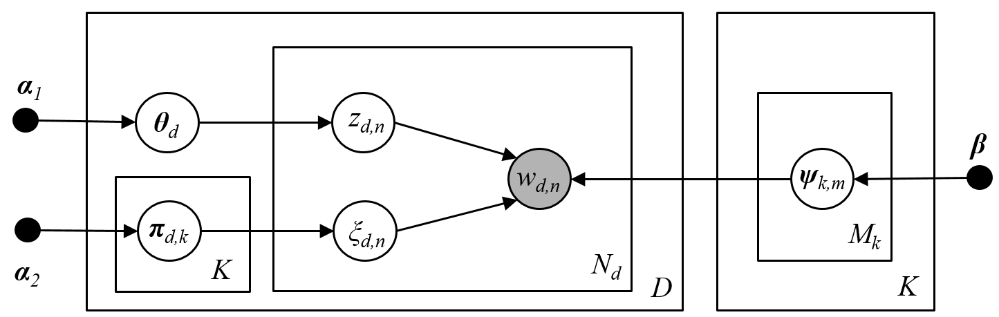

This provides a description to implement the GMM-LDA topic model. The GMM-LDA topic model is an extension to the popular latent Dirichlet allocation (LDA) topic model by Blei et. al 2003, where the topics are modeled as Gaussian mixture models to readily handle continuous domain data. Technical details about the model can be found in Prabhudesai et. al, 2018 (conference paper appearing at ICASSP, 2018 -- Calgary, Canada). A probabilistic graphical representation of the model is given as follows:

Gibbs sampling implementation is done in C++ utilizing the [Armadillo](http://arma.sourceforge.net/docs.html) linear algebra library. The C++ code is converted to mex function (.mexw64) using Visual Studio 2017 compiler. The new topic model is applied to the problem of clustering sleep stages from EEG signals. 
